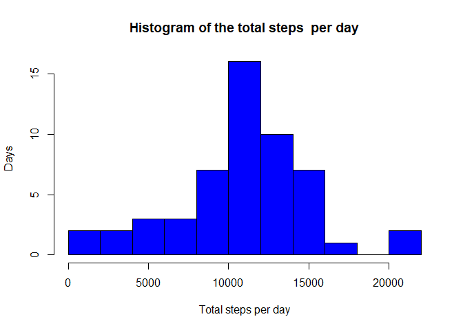
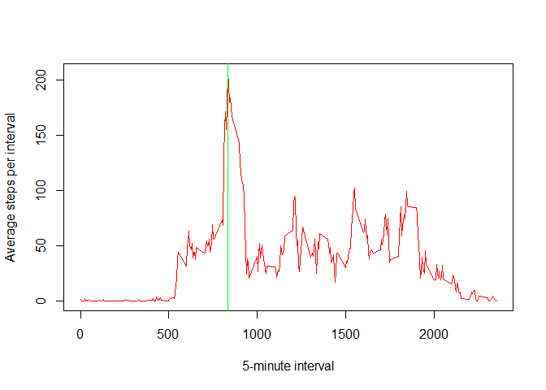
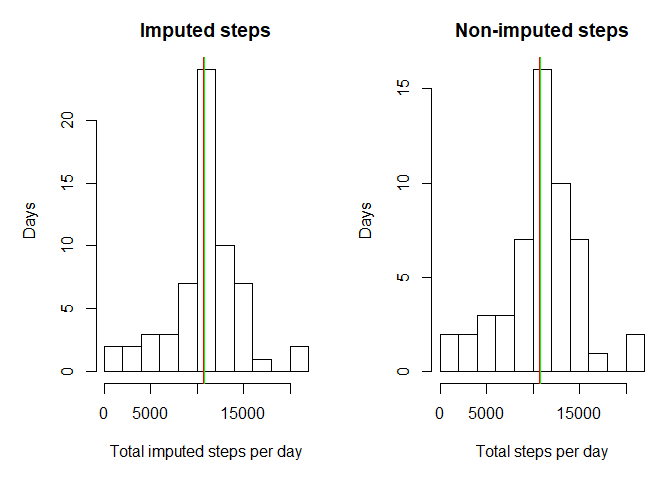
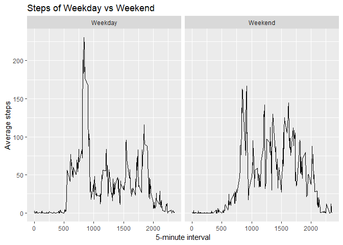

## 1. Load the data and  Process the data
   
   
- Process/transform the data into a format suitable for your analysis    
- Update date and add weekday variable    


```r
 act <-read.csv("activity.csv", header=T) 
 library(dplyr)
```

```
## 
## Attaching package: 'dplyr'
```

```
## The following objects are masked from 'package:stats':
## 
##     filter, lag
```

```
## The following objects are masked from 'package:base':
## 
##     intersect, setdiff, setequal, union
```

```r
 library(lubridate)
```

```
## 
## Attaching package: 'lubridate'
```

```
## The following object is masked from 'package:base':
## 
##     date
```

```r
 act <- act %>%
      mutate(date= as.Date(as.character(date),"%Y-%m-%d"), 
              wkd=weekdays(date),
          weekday=ifelse(wday(date) %in% c(1,7),"Weekend","Weekday"))
```
 
## 2. Total number of steps taken per day  
 

```r
actsum <- act %>%
      group_by(date ) %>%
      summarize(total=sum(steps))

Mean_pd<- mean(actsum$total,na.rm=T)   
Median_pd<- median(actsum$total,na.rm=T) 

with(actsum, hist(total, breaks=10, xlab="Total steps per day" , main="Histogram of the total steps  per day", col='blue', ylab="Days"))
```

<!-- -->

The mean of the total number of steps taken per day is 1.0766189\times 10^{4}.  
  
The median of the total number of steps taken per day is 10765.  
 


## 3. The average daily activity pattern  

Time series plot of the 5-minute interval (x-axis) and the average number of steps taken, averaged across all days (y-axis)
 

```r
 avg_int <-act %>%
                select(steps,interval) %>%
                group_by(interval) %>%
                summarize(avg=mean(steps,na.rm=T))

  
  intv <-avg_int$interval[avg_int$avg==max(avg_int$avg)]
  with(avg_int, plot(interval,avg, type='l', col='red', 
            ylab="Average steps per interval",xlab='5-minute interval'))
  abline(v=intv, col='green')
```

<!-- -->


 5-minute interval(835), on average across all the days in the dataset, contains the maximum number of steps.  
   
 
## 4. Imputing missing values  

 - Calculate and report the total number of missing values in the dataset.    
  

```r
missing <- is.na(act$steps)
cnt_m <- table(missing) 
```
Total 2304 number of missing values in the dataset.

 - Using average steps per interval to impute  missing steps.  
  

```r
imp_act <- merge(act ,avg_int, by='interval') %>%
        arrange(date,interval) %>%
        mutate(imp_steps = ifelse(is.na(steps),avg, steps))
```
   
   
 -The histogram of the total number of steps taken each day and Calculate and report the mean and median total number of steps taken per day. Do these values differ from the estimates from the first part of the assignment? What is the impact of imputing missing data on the estimates of the total daily number of steps?


```r
imp_sum <- imp_act %>%
      group_by(weekday,wkd,date) %>%
      summarize(total=sum(imp_steps))
      
imp_Mean  <- mean(imp_sum$total,na.rm=T)   
imp_Median<- median(imp_sum$total,na.rm=T) 

par(mfrow=c(1,2), mar=c(5,5,3,1))
with(imp_sum, hist(total, breaks=10, xlab="Total imputed steps per day" , main="Imputed steps",   ylab="Days"))
abline(v=imp_Mean, col='red',lwd=2)
abline(v=imp_Median, col='green')

with(actsum, hist(total, breaks=10, xlab="Total steps per day" , main="Non-imputed steps",  ylab="Days"))
abline(v=Mean_pd, col='red',lwd=2)
abline(v=Median_pd, col='green')
```

<!-- -->

Median (1.0766189\times 10^{4}) value  are little differnent between imputed and non-imputed missing value. Mean(1.0766189\times 10^{4}) values are same. The number of days of imputed steps in histogram plot is more than non-imputed missing steps.


## 5. The differences in activity patterns between weekdays and weekends 
 
Theplot containing a time series plot of the 5-minute interval (x-axis) and the average number of steps taken, averaged across all weekday days or weekend days (y-axis). 


```r
library(ggplot2)
 imp_avg <-imp_act %>%
          select(weekday,interval,imp_steps) %>%
          group_by(weekday,interval) %>%
          summarize(avg=mean(imp_steps,na.rm=T))

   
 ggplot(imp_avg, aes(interval,avg))+
    geom_line()+
    facet_wrap(.~weekday)+
    labs(title="Steps of Weekday vs Weekend", x="5-minute interval", y="Average steps")
```

<!-- -->
